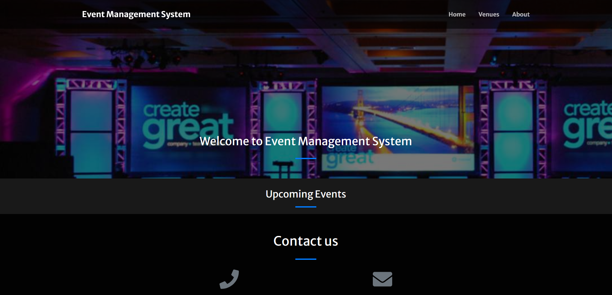
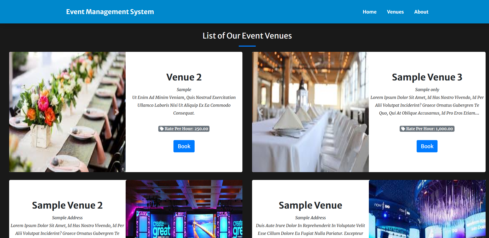
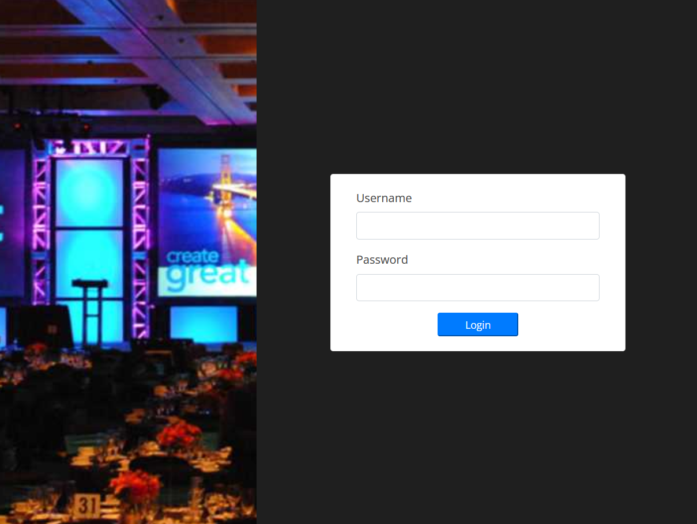

# DBMS-Project

## EVENT MANAGEMENT SYSTSEM
* Event management system provides multi user authentication( admin and students)
* Administrators can managae the events with CRUD operations , host the events and can manage all registered profiles.
* Students can see the upcoming events , events they have registered and can create their profiles on this platform.

### Technology used

* Front-End: HTML,CSS,Javascript
*  Back-End : MySQL,php
*  Server: Xampp

 ### Screenshots
 
 
 

